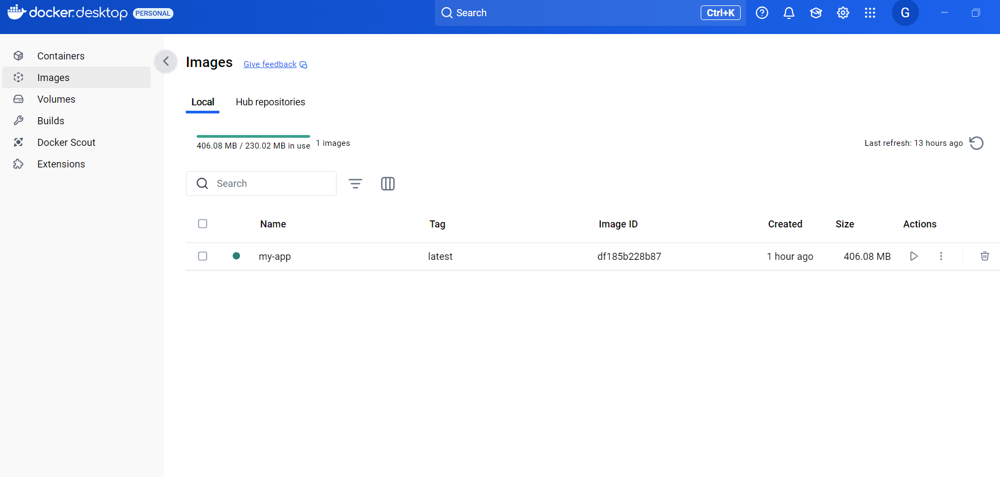
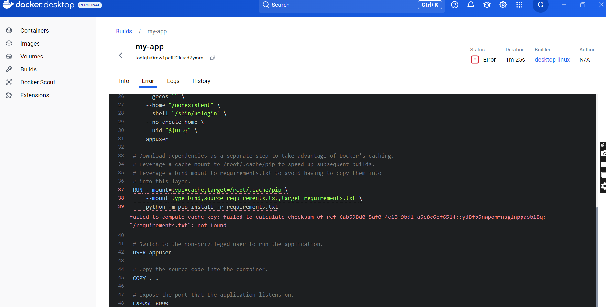

## clone
- Created a simple Dockerfile for a basic web application using the following GitHub repository: https://github.com/josephifekwe97/my-app.git.
# run docker
- I ran "docker run -d -p 3000:3000 --name my-app-container my-app:latest" to expose port 3000 and run a container using the built image
it was successful
- i ran "docker ps" to see if it was

- i ran "docker ps -a" to see the list of running containers

- Docker image

- Docker Container

- There was an error in the build

- I corrected it in the dockerfile
it worked

# List of all commands
- "docker build -t my-app:latest ." to build the container
- "docker run -d -p 3000:3000 --name my-app-container my-app:latest" to run the built container
- "docker ps -a" to list all containers
- "docker start my-app-container" to start the container
- "docker stop my-app-container" to stop container
- "docker rm my-app-container" to remove the container

## Second part
- Explore Docker Networking:
Set up a Docker container with a custom network configuration. Provide the network configuration details and commands used to set it up.

## Summary of Commands:
Create a custom network:
- I ran "docker network create --driver bridge --subnet 192.168.100.0/24 --gateway 192.168.100.1 my-custom-network"

- I ran "docker network inspect my-custom-network" to inspect the network

- To run a container with the custom network:

docker run -d --name my-container --network my-custom-network nginx

- Inspect the container's network configuration:
docker inspect my-container

Result 

- Run a second container on the same custom network:
docker run -d --name my-second-container --network my-custom-network redis

- Disconnect a container from the network:
docker network disconnect my-custom-network my-container

Remove the custom network:
docker network rm my-custom-network

This setup allows you to configure your Docker containers with a custom network, providing more control over their IP addresses, subnets, and communication between containers.