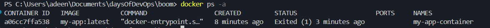
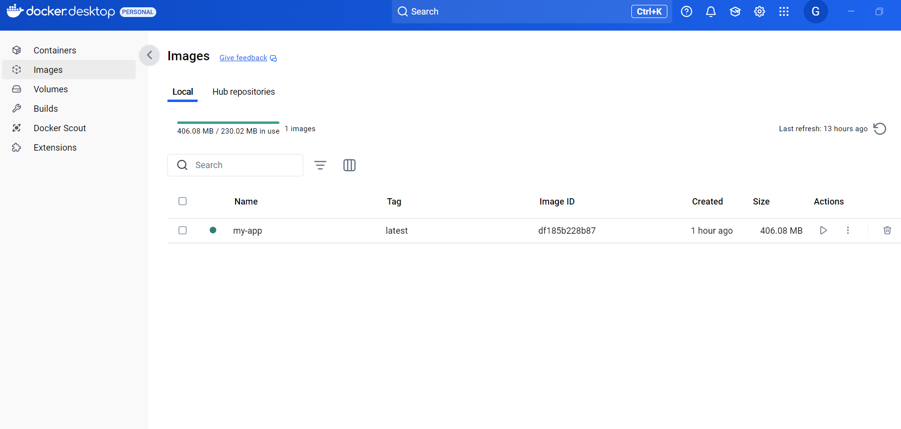
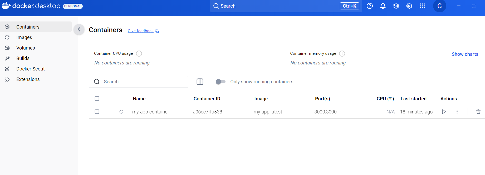
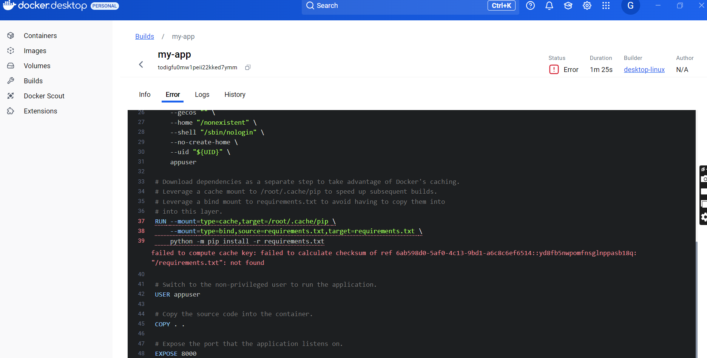
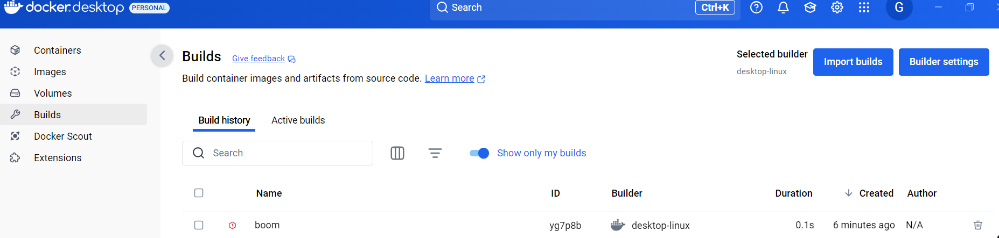

- Created a simple Dockerfile for a basic web application using the following GitHub repository: https://github.com/josephifekwe97/my-app.git.
- I ran "docker run -d -p 3000:3000 --name my-app-container my-app:latest" to expose port 3000 and run a container using the built image
it was successful
- i ran "docker ps" to see if it was

- i ran "docker ps -a" to see the list of running containers

- Docker image

- Docker Container

- There was an error in the build

- I corrected it in the dockerfile
it worked

List of all commands
- "docker build -t my-app:latest ." to build the container
- "docker run -d -p 3000:3000 --name my-app-container my-app:latest" to run the built container
- "docker ps -a" to list all containers
- "docker start my-app-container" to start the container
- "docker stop my-app-container" to stop container
- "docker rm my-app-container" to remove the container

